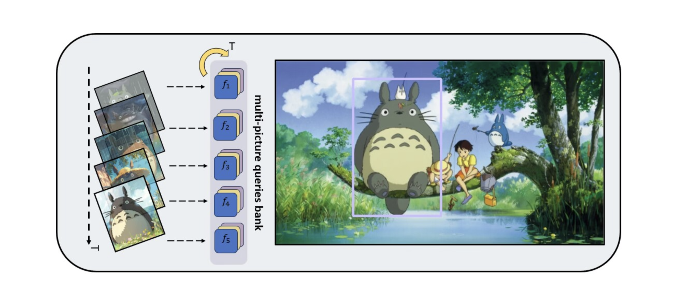

# MP-Det 多模态提示的目标检测模型

## 介绍

### 多视觉提示模型-VIOSD

Visual Intersection Open Set Detection



仅训练objects365数据集，即可接近主流Open Vocabulary方法效果：

```Odinw-35
| Dataset      | AP （GLIP） |  AP （Ours） ｜
| ----------- | ----------- | ----------- |
| COCO      |   49.8  |       |
| LVIS  |    26.9    |  29.3       |
| Obj365  | 36.2    |  37.9     |
| Odinw-35  |   23.4     |  22.0       |
```

## 端到端推理

```python
python tools/infer.py
```

在参数中修改提示图片和目标图片即可

## 权重地址

待更新

## 安装

1 准备环境：cuda11.7+ torch2.0+ （提示：用conda装虚拟环境，装torch的时候对准cuda）

2

```bash
pip install -r requirements.txt
```

3
去github上通过源码安装detectron，clip和detrex

4
python3 -m pip install -e .

## 介绍

## 多视觉提示模型-VIOSD

Visual Intersection Open Set Detection


仅训练objects365数据集，即可接近主流Open Vocabulary方法效果：


| Dataset  | AP （GLIP） | AP （Ours）  |
| ---------- | ------------- | --------------- |
| COCO     | 49.8        | 60.9          |
| LVIS     | 26.9        | 29.3          |
| Obj365   | 36.2        | 37.9          |
| Odinw-35 | 23.4        | 22.0          |

## 端到端推理代码

```python
python tools/infer.py
```

在参数中修改提示图片和目标图片即可

## 权重地址

待更新

## 安装

1 准备环境：cuda11.7+ torch2.0+ （提示：用conda装虚拟环境，装torch的时候对准cuda）

2

```bash
pip install -r requirements.txt
```

3
去github上通过源码安装detectron，clip和detrex

4
python3 -m pip install -e .
